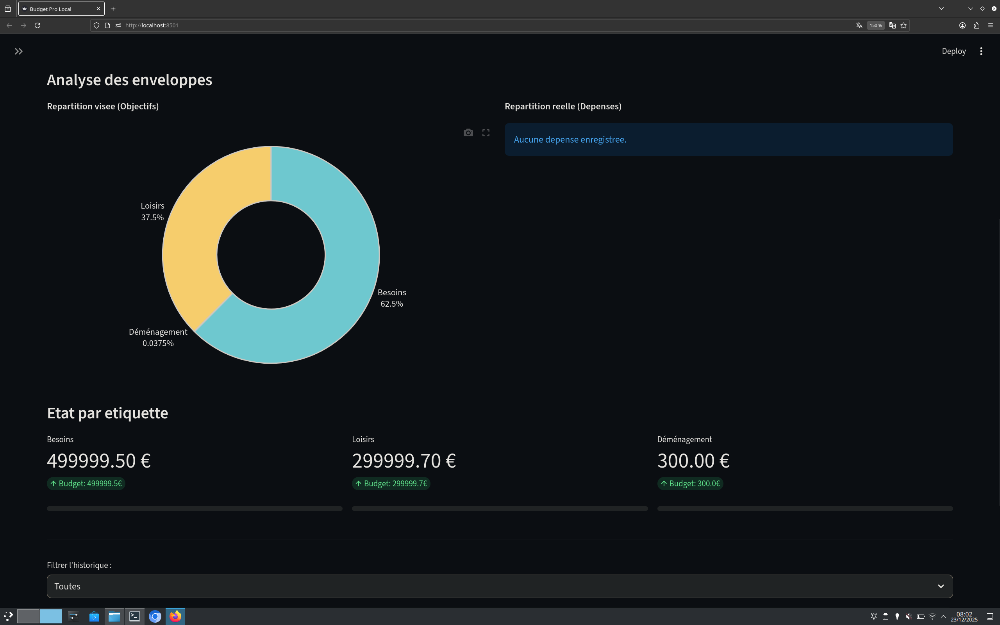

# Budget

Un outil simple pour gerer son argent en local, sans cloud et sans fioritures.



## Pourquoi cet outil ? (Contexte AIP)

Ce projet est pense pour les eleves fonctionnaires devant gerer leur installation (AIP). 

L'idee est d'eviter la multiplication des comptes ou des cartes bancaires. Grace au systeme d'etiquettes :
- On separe virtuellement les frais d'installation du reste.
- On garde une seule carte bancaire pour tout, avec une vision claire par enveloppe.
- On stocke ses justificatifs directement dans l'outil pour le suivi administratif.


## Fonctions

- Gestion par pourcentage ou montant fixe (seuil).
- Etiquettes personnalisables pour compartimenter son budget.
- Ajout de factures en pieces jointes.
- Analyse visuelle (objectifs vs realite).
- Donnees stockees localement en CSV pour une confidentialite totale.

## Installation

1. Creer un environnement virtuel :
```text
python -m venv venv
```
# Installation

1. Creer un environnement virtuel :
```python
   python -m venv
```
3. Activer l'environnement :
```text
 - Windows : venv\Scripts\activate
  - Mac/Linux : source venv/bin/activate
```
4. Installer les dependances :
```python
pip install -r requirements.txt
```
5. Lancer l'application :
```python
streamlit run app.py
```


